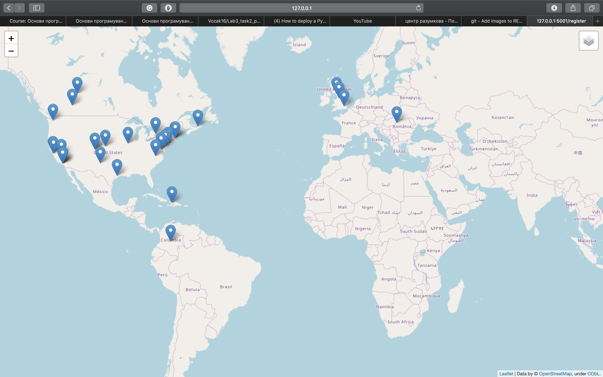

### What it does:
    This module defines coordinates of all locations, which are the locations of user's friends.
    Module returns a web-map with three layers:
    1. The main layer with simple map.
    2. The layer with friend locations

### What do you need for usage of it:
    You need to install those libraries: folium, ssl, certifi, geopy.
    Use the package manager [pip](https://pip.pypa.io/en/stable/) to install those libraries.
    pip install folium
    pip install ssl
    pip install certifi
    pip install geopy
### Structure of an html document:
    html document is divided into two parts:
    - head: it contains all the information about html document (Meta Data, version of html document and style)
    -body: it contains everything that will be displayed on the web page.

    <!DOCTYPE> - defines the type of documents.
    <head> - defines the whole information about the document.
    <meta> - defines metadata about html document.
    <style> - defines style for html document; here you specify how html document will render in a browser.
    <link> - connects document and external resource.
    <body> - defines the body of document; it contains all the contents of this document (text, images, tables, etc.)
    
 - defines a section in html document.

### How it use and result of launching:
    * Running on http://127.0.0.1:5001/ (Press CTRL+C to quit)
    * Serving Flask app "flask_app_savchuk" (lazy loading)
    * Environment: production
    WARNING: This is a development server. Do not use it in a production deployment.
    Use a production WSGI server instead.
    * Debug mode: off
    127.0.0.1 - - [25/Feb/2020 14:18:57] "GET / HTTP/1.1" 200 -
    elonmusk
    Please, wait from 10 seconds to one minute map is generating.
    127.0.0.1 - - [25/Feb/2020 14:19:35] "POST /register HTTP/1.1" 200 -

    

### Contributing
    Pull requests are welcome. For major changes, please open an issue first to discuss what you would like to change.

    Please make sure to update tests as appropriate.

